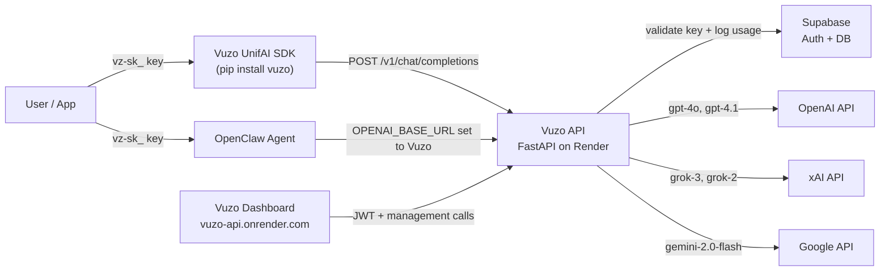
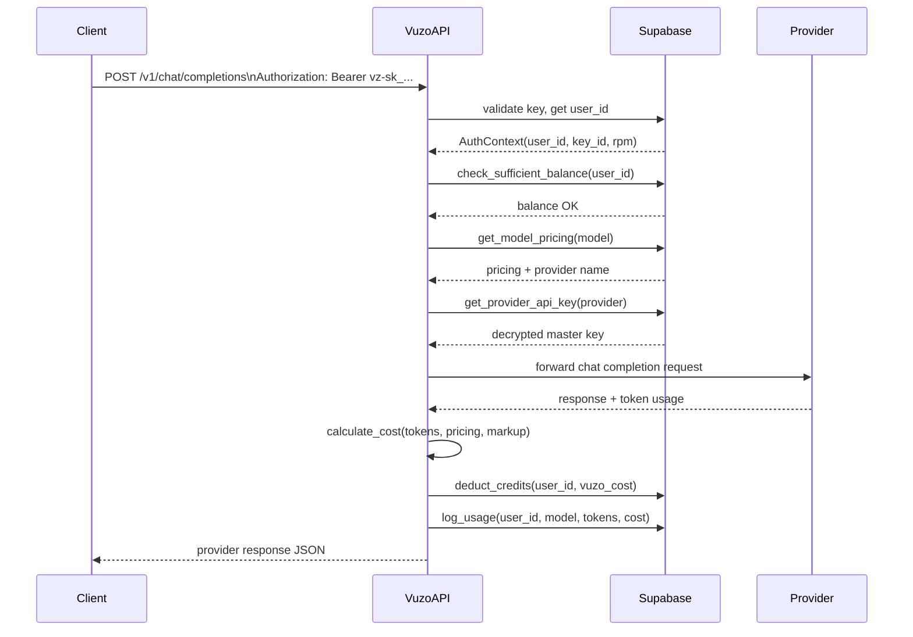

# Vuzo UnifAI — Internal Architecture & Engineering Reference

This document is for the Vuzo team. It covers how everything is built, why decisions were made, and what still needs to be done.

---

## Table of Contents

1. [Changelog](#changelog)
2. [System Overview](#system-overview)
3. [Why We Built the PyPI Package (vuzo-unifai)](#why-we-built-the-pypi-package-vuzo-unifai)
4. [How the Render Deployment Works](#how-the-render-deployment-works)
5. [Backend Architecture](#backend-architecture)
6. [Authentication Deep Dive](#authentication-deep-dive)
7. [Proxy & Routing Flow](#proxy--routing-flow)
8. [Billing System](#billing-system)
9. [Provider System](#provider-system)
10. [SDK ↔ API Mapping](#sdk--api-mapping)
11. [OpenClaw Integration Notes](#openclaw-integration-notes)
12. [Known Limitations & TODOs](#known-limitations--todos)

---

## Changelog

See [CHANGELOG.md](CHANGELOG.md) for the full version history.

---

## System Overview

Vuzo UnifAI is a multi-layer system. Users interact with either the web dashboard or the Python SDK (or any OpenAI-compatible client). All model requests flow through the Vuzo API server, which handles auth, billing, routing, and proxying to the actual AI providers.



### Key design principles

- **Single endpoint for all models.** Users never change their base URL or auth when switching models.
- **Master keys stay server-side.** Provider API keys (OpenAI, xAI, Google) are encrypted at rest and only decrypted at request time. Users only ever hold a `vz-sk_` key.
- **OpenAI-compatible input format.** The `/v1/chat/completions` endpoint accepts the same request shape as OpenAI, so any OpenAI SDK can point at Vuzo with no code changes.
- **Credit-based billing with markup.** We pay providers at their listed rates and charge users with a configurable markup per model.

---

## Why We Built the PyPI Package (vuzo-unifai)

The package is published on PyPI as `vuzo` (`pip install vuzo`) and the product name is **Vuzo UnifAI**. The PyPI name `vuzo-unifai` was the registered project name at time of first upload but the installable name resolved to `vuzo`.

### Problems it solves

**Without the SDK**, a user has to:
- Know to set `base_url="https://vuzo-api.onrender.com/v1"` manually
- Use the raw OpenAI SDK (which works, but means carrying an extra dependency that wasn't designed for Vuzo)
- Handle raw dicts instead of typed responses
- Parse error codes manually

**With the SDK**, the user just does:
```python
from vuzo import Vuzo
client = Vuzo("vz-sk_...")
client.chat.complete("gpt-4o-mini", "Hello")
```

### What the SDK adds on top of raw HTTP

| Concern | Without SDK | With SDK |
|---|---|---|
| Base URL | Must set manually on every client | Baked in as default |
| Auth | Pass as header manually | Handled by `Vuzo("vz-sk_...")` |
| Response parsing | Raw dict access | Pydantic models (`response.choices[0].message.content`) |
| Error handling | Check `status_code` manually | Typed exceptions (`AuthenticationError`, etc.) |
| Streaming | Manually parse SSE `data:` lines | `client.chat.stream()` yields strings |
| Usage/billing | Separate HTTP calls with manual auth | `client.usage.summary()`, `client.billing.get_balance()` |

### Why it also enables third-party tool integration

Tools like OpenClaw, LangChain, and agent frameworks that accept a custom OpenAI base URL can use Vuzo UnifAI without knowing it exists — they just see an "OpenAI-compatible API". The SDK is the polished, branded entry point for developers who want the full Vuzo experience rather than the generic compatibility shim.

---

## How the Render Deployment Works

Two services are defined in `render.yaml` and deployed together on [Render](https://render.com).

### Service 1: `vuzo-api` (Python backend)

| Property | Value |
|---|---|
| Runtime | Python 3.12.0 |
| Build command | `pip install -r requirements.txt` |
| Start command | `uvicorn app.main:app --host 0.0.0.0 --port $PORT` |
| Port | `10000` (production), `8000` (local) |
| Public URL | `https://vuzo-api.onrender.com` |

**Environment variables required (all set as secrets in Render dashboard):**

| Variable | Purpose |
|---|---|
| `SUPABASE_URL` | Supabase project URL |
| `SUPABASE_KEY` | Supabase anon key |
| `SUPABASE_SERVICE_ROLE_KEY` | Admin key for server-side DB operations |
| `SUPABASE_JWT_SECRET` | For validating user JWTs from the dashboard |
| `PROVIDER_ENCRYPTION_KEY` | Fernet key for encrypting/decrypting provider API keys stored in DB |
| `POLAR_ACCESS_TOKEN` | Polar payments API token |
| `POLAR_WEBHOOK_SECRET` | Validates Polar webhook payloads |
| `FRONTEND_URL` | Allowed CORS origin |
| `APP_ENV` | `production` or `development` |

### Service 2: `vuzo-dashboard` (React SPA)

| Property | Value |
|---|---|
| Runtime | Static site |
| Root directory | `frontend/` |
| Build command | `npm install && npm run build` |
| Publish directory | `dist/` |
| SPA routing | All `/*` rewrites to `/index.html` |

**Frontend environment variables (VITE_ prefix, baked in at build time):**

| Variable | Purpose |
|---|---|
| `VITE_SUPABASE_URL` | Supabase URL (same as backend) |
| `VITE_SUPABASE_ANON_KEY` | Supabase anon key for client-side auth |
| `VITE_API_BASE_URL` | Points to the `vuzo-api` service URL |

### Local development

```bash
# Backend (from repo root)
cd backend
cp .env.example .env   # fill in values
python run.py          # starts on localhost:8000

# Frontend (from repo root)
cd frontend
cp .env.example .env   # set VITE_API_BASE_URL=http://localhost:8000
npm install
npm run dev            # starts on localhost:5173
```

---

## Backend Architecture

### FastAPI app structure

```
app/
├── main.py           # App factory: mounts routers, configures CORS, lifespan
├── config.py         # Pydantic Settings (reads from .env)
├── dependencies.py   # Shared auth dependency (accepts both vz- and JWT)
├── middleware/
│   ├── auth.py       # Validates vz-sk_ API keys
│   ├── jwt_auth.py   # Validates Supabase JWTs
│   └── rate_limiter.py  # Supabase-backed sliding window (per API key)
├── routers/
│   ├── proxy.py      # POST /v1/chat/completions  ← the core endpoint
│   ├── auth.py       # /v1/auth/register, login, refresh
│   ├── api_keys.py   # /v1/api-keys CRUD
│   ├── usage.py      # /v1/usage, /v1/usage/summary, /v1/usage/daily
│   ├── billing.py    # /v1/billing/balance, topup, transactions, checkout
│   ├── polar.py      # /v1/webhooks/polar
│   └── models_list.py  # GET /v1/models
├── services/
│   ├── providers/    # AI provider implementations
│   ├── billing_service.py
│   ├── key_service.py
│   ├── pricing_service.py
│   └── usage_service.py
└── utils/
    ├── crypto.py     # Key generation, SHA-256 hashing, Fernet encryption
    └── pricing.py    # Cost calculation formula
```

### Middleware stack (order matters)

Every incoming request passes through in this order:

```
Request
  → CORS middleware (allows frontend origin)
  → Rate limiter (checked per API key, Supabase-backed sliding window)
  → Route handler (which calls validate_api_key or validate_jwt as a FastAPI dependency)
```

Rate limiting is applied **before** auth for the proxy endpoint so malicious actors can't bypass it. The rate limiter uses the raw `Authorization` header value as the key identifier, so it works even before the key is validated. Rate-limit state is stored in the `rate_limit_requests` Supabase table, making it safe across multiple Render instances. The middleware fails open — if Supabase is unreachable, requests pass through rather than being incorrectly blocked.

### Router prefix layout

All routes are mounted under `/v1` prefix in `main.py`. The health check at `/health` is at root level. This means:

- `POST /v1/chat/completions` — proxy
- `GET /v1/models` — models list
- `POST /v1/auth/register` — registration
- etc.

This makes the server a drop-in replacement for OpenAI's `https://api.openai.com/v1` base path.

---

## Authentication Deep Dive

There are two separate auth systems that coexist in the same app.

### System 1: Vuzo API Keys (`vz-sk_` prefix)

Used by developers calling the LLM proxy and management endpoints programmatically.

**Key format:** `vz-sk_` + 48 hex characters (generated via `secrets.token_hex(24)`)

**Storage in Supabase `api_keys` table:**

| Column | What's stored | Why |
|---|---|---|
| `key_prefix` | First 8 characters | Indexed for fast lookup without full key |
| `key_hash` | SHA-256 of full key | Verify without storing the plaintext key |
| `is_active` | bool | Soft delete / revoke |
| `rate_limit_rpm` | int | Per-key rate limits |

The full key is **shown once** at creation and never stored. This means if a user loses their key, they must create a new one.

**Validation flow** (`app/middleware/auth.py`):

```
Authorization: Bearer vz-sk_a1b2c3...
          ↓
1. Strip "Bearer ", check "vz-" prefix
2. Extract key_prefix = first 8 chars after "vz-sk_"
3. SELECT * FROM api_keys WHERE key_prefix = ? AND is_active = true
4. SHA-256 hash the full incoming key
5. Compare hash against stored key_hash
6. Check user.is_active = true
7. UPDATE api_keys SET last_used_at = now()
8. Return AuthContext(user_id, api_key_id, rate_limit_rpm)
```

### System 2: Supabase JWT (dashboard users)

Used by the React frontend to authenticate management operations (viewing usage, billing, etc.).

- Supabase Auth handles sign-up/sign-in and issues JWTs
- Frontend sends `Authorization: Bearer <supabase_jwt>`
- Backend validates JWT signature using `SUPABASE_JWT_SECRET`
- Extracts `sub` claim (Supabase Auth UUID)
- Looks up Vuzo user by `supabase_auth_id`

### Unified dependency

`app/dependencies.py` exposes `get_current_user_id()` which accepts **both** auth methods:

```python
# If token starts with "vz-" → API key validation
# Otherwise → JWT validation
```

This means dashboard API calls (e.g. `GET /v1/usage`) work with either auth method, which is useful for testing and for power users who want to call management endpoints from scripts.

---

## Proxy & Routing Flow

### Sequence for a non-streaming request



### Key files

| Step | File |
|---|---|
| Entry point | `app/routers/proxy.py` |
| Auth validation | `app/middleware/auth.py` |
| Balance check | `app/services/billing_service.py` → `check_sufficient_balance()` |
| Pricing lookup | `app/services/pricing_service.py` → `get_model_pricing()` |
| Provider key retrieval | `app/services/pricing_service.py` → `get_provider_api_key()` |
| Provider dispatch | `app/services/providers/*.py` |
| Cost calculation | `app/utils/pricing.py` → `calculate_cost()` |
| Credit deduction | `app/services/billing_service.py` → `deduct_credits()` |
| Usage logging | `app/services/usage_service.py` → `log_usage()` |

### Cost calculation formula

```python
provider_cost = (input_tokens / 1_000_000 * input_price_per_million) \
              + (output_tokens / 1_000_000 * output_price_per_million)

vuzo_cost = provider_cost * (1 + vuzo_markup_percent / 100)
```

The markup percentage is configurable per model in the `model_pricing` table in Supabase (default: 20%).

---

## Billing System

### Credit flow

```
User tops up ($10)
  → Polar checkout session created (POST /v1/billing/checkout)
  → User pays via Polar
  → Polar fires webhook to POST /v1/webhooks/polar
  → We verify webhook signature (POLAR_WEBHOOK_SECRET)
  → On order.created event: add_credits(user_id, amount)
  → Transaction recorded (type: "topup")

User makes an API call
  → deduct_credits(user_id, vuzo_cost, description)
  → Transaction recorded (type: "usage")
  → If balance < $0.001 before request: raise 402 InsufficientFunds
```

### Supabase tables involved

| Table | Purpose |
|---|---|
| `credits` | Current balance per user (NUMERIC 12,6 precision) |
| `transactions` | Ledger of every topup, usage deduction, and refund |
| `usage_logs` | Per-request log: model, tokens, provider cost, vuzo cost, latency |

### Balance precision

Balances are stored as `NUMERIC(12,6)` — 6 decimal places. This is important because per-request costs can be fractions of a cent (e.g. `$0.000012` for a small Gemini call). Dollar precision would silently lose money.

---

## Provider System

### BaseProvider interface

All providers implement `app/services/providers/base.py`:

```python
class BaseProvider(ABC):
    @abstractmethod
    async def chat_completion(self, request: ChatCompletionRequest, api_key: str) -> ProviderResult:
        ...

    @abstractmethod
    async def chat_completion_stream(self, request: ChatCompletionRequest, api_key: str):
        # yields (chunk_str, usage_or_None) tuples
        ...

    @abstractmethod
    def model_supported(self, model: str) -> bool:
        ...
```

### Current providers

| Provider | File | Models |
|---|---|---|
| OpenAI | `providers/openai.py` | gpt-4o, gpt-4o-mini, gpt-4.1, gpt-4.1-mini, gpt-4.1-nano |
| xAI | `providers/xai.py` | grok-3, grok-3-mini, grok-2 |
| Google | `providers/google.py` | gemini-2.0-flash, gemini-3-flash |
| Anthropic | `providers/anthropic.py` | claude-sonnet-4-20250514, claude-haiku-4-5, claude-opus-4-5 |

Anthropic (`providers/anthropic.py`) is fully wired in. Claude models are exposed via the routing table and model pricing.

### How to add a new provider

1. Create `app/services/providers/newprovider.py` implementing `BaseProvider`
2. Add it to the provider list in `app/routers/proxy.py`:
   ```python
   _newprovider = NewProvider()
   _providers = [_openai, _xai, _google, _newprovider]
   ```
3. Add model pricing rows to the `model_pricing` table in Supabase with `provider = "newprovider"`
4. Store the provider's master API key in the `provider_keys` table (encrypted)

### Response format

All four providers return responses normalized to the OpenAI `chat.completion` / `chat.completion.chunk` shape before the response reaches the caller. This means every model on Vuzo is usable through any OpenAI-compatible client (OpenClaw, LangChain, LlamaIndex, Cursor, etc.) with no special handling required.

---

## SDK ↔ API Mapping

Every method in the Vuzo UnifAI SDK maps directly to a Vuzo API endpoint.

| SDK Method | HTTP Method | Endpoint |
|---|---|---|
| `client.chat.create(...)` | `POST` | `/v1/chat/completions` |
| `client.chat.complete(...)` | `POST` | `/v1/chat/completions` (simplified wrapper) |
| `client.chat.stream(...)` | `POST` | `/v1/chat/completions` (stream=True) |
| `client.models.list()` | `GET` | `/v1/models` |
| `client.models.get(name)` | `GET` | `/v1/models/{model_name}` |
| `client.usage.list(...)` | `GET` | `/v1/usage` |
| `client.usage.summary(...)` | `GET` | `/v1/usage/summary` |
| `client.usage.daily(...)` | `GET` | `/v1/usage/daily` |
| `client.billing.get_balance()` | `GET` | `/v1/billing/balance` |
| `client.billing.top_up(amount)` | `POST` | `/v1/billing/topup` |
| `client.billing.transactions(...)` | `GET` | `/v1/billing/transactions` |
| `client.api_keys.create(name)` | `POST` | `/v1/api-keys` |
| `client.api_keys.list()` | `GET` | `/v1/api-keys` |
| `client.api_keys.delete(id)` | `DELETE` | `/v1/api-keys/{key_id}` |

All SDK requests pass the Vuzo API key as `Authorization: Bearer vz-sk_...`.

---

## OpenClaw Integration Notes

[OpenClaw](https://openclaw.ai) is an open-source personal AI agent. It supports a custom OpenAI base URL, which is the hook we use.

### Why it works

OpenClaw uses the OpenAI SDK internally. When you set:

```bash
OPENAI_API_KEY="vz-sk_..."
OPENAI_BASE_URL="https://vuzo-api.onrender.com/v1"
```

OpenClaw's OpenAI SDK calls go to Vuzo's `/v1/chat/completions` instead of OpenAI's. Because our input format is identical to OpenAI's (same JSON schema: `model`, `messages`, `temperature`, `stream`, etc.), the request passes through without modification. All provider responses are normalized to the OpenAI shape before returning, so every Vuzo model works out of the box.

### Known limitations

None at this time.

---

## Known Limitations & TODOs

### Resolved (Feb 2026)

| Issue | Location | Notes |
|---|---|---|
| Response normalization for Google | `providers/google.py` | ✅ `_normalize_response()` and streaming chunk translation added |
| Response normalization for Anthropic | `providers/anthropic.py` | ✅ `_normalize_response()` and Anthropic event → OpenAI delta mapping added |
| Claude models not exposed | `proxy.py` | ✅ `AnthropicProvider` imported and added to `_providers` |
| Missing tests | `tests/` | ✅ `tests/` directory created with pytest suites for pricing, providers, crypto, schemas, and rate limiter |
| Rate limiter is in-memory | `middleware/rate_limiter.py` | ✅ Replaced with Supabase-backed sliding window — safe across multiple Render instances. Requires `rate_limit_requests` table (see below) |
| `GET /v1/models/{model_name}` missing | `routers/models_list.py` | ✅ Dedicated single-model endpoint added; SDK `client.models.get()` can now call it directly |
| `POST /v1/billing/topup` exposed in production | `routers/billing.py` | ✅ Returns `403` when `APP_ENV=production`; only available in development/testing |

### Rate limiter table migration

Run once in Supabase SQL editor before deploying the updated rate limiter:

```sql
CREATE TABLE IF NOT EXISTS rate_limit_requests (
    id           UUID        DEFAULT gen_random_uuid() PRIMARY KEY,
    key_prefix   TEXT        NOT NULL,
    requested_at TIMESTAMPTZ NOT NULL DEFAULT now()
);
CREATE INDEX IF NOT EXISTS idx_rl_prefix_time
    ON rate_limit_requests (key_prefix, requested_at);
```

### Remaining / nice to have

All items resolved as of Feb 2026.

| Issue | Notes |
|---|---|
| `setup.py` duplication in the SDK repo | ✅ `setup.py` deleted from `vuzo-python/`. `pyproject.toml` is the sole build config. |
| No async version of the SDK | ✅ `AsyncVuzo` added to `vuzo-python/` using `httpx`. Install with `pip install vuzo[async]`. Supports `async with` context manager. |
| No JavaScript/TypeScript SDK | ✅ `vuzo-js/` created at `~/Downloads/vuzo-js/`. Full TypeScript SDK using native `fetch` (Node 18+), dual CJS/ESM output, all endpoints covered. |

---

## Database Schema

All tables live in the `public` schema of Supabase (PostgreSQL).

### `users`

Stores Vuzo user accounts. Linked to Supabase Auth via `supabase_auth_id`.

| Column | Type | Description |
|--------|------|-------------|
| `id` | UUID (PK) | Internal Vuzo user ID |
| `supabase_auth_id` | UUID (unique) | Supabase Auth UUID (`auth.users.id`) |
| `email` | TEXT (unique) | User's email |
| `name` | TEXT | Display name |
| `is_active` | BOOLEAN | Whether the account is enabled |
| `created_at` | TIMESTAMPTZ | Account creation timestamp |

### `api_keys`

Vuzo API keys issued to users. The actual key is never stored — only a SHA-256 hash and a lookup prefix.

| Column | Type | Description |
|--------|------|-------------|
| `id` | UUID (PK) | Key record ID |
| `user_id` | UUID (FK) | References `users.id` |
| `key_prefix` | TEXT | First 8 chars of the key (for fast DB lookup) |
| `key_hash` | TEXT | SHA-256 hash of the full key |
| `name` | TEXT | User-assigned label (e.g. "Production") |
| `is_active` | BOOLEAN | False = revoked |
| `rate_limit_rpm` | INTEGER | Max requests per minute for this key |
| `created_at` | TIMESTAMPTZ | When the key was created |
| `last_used_at` | TIMESTAMPTZ | Updated on every authenticated request |

### `credits`

One row per user. Stores the current USD credit balance.

| Column | Type | Description |
|--------|------|-------------|
| `id` | UUID (PK) | Row ID |
| `user_id` | UUID (FK, unique) | References `users.id` |
| `balance` | NUMERIC(12,6) | Current balance in USD |
| `updated_at` | TIMESTAMPTZ | Last balance change timestamp |

### `credit_transactions`

Audit log of every balance change: top-ups, usage deductions, refunds.

| Column | Type | Description |
|--------|------|-------------|
| `id` | UUID (PK) | Transaction ID |
| `user_id` | UUID (FK) | References `users.id` |
| `amount` | NUMERIC(12,6) | Positive = top-up, negative = usage deduction |
| `type` | ENUM | `topup`, `usage`, or `refund` |
| `description` | TEXT | Human-readable note (e.g. "gpt-4o: 500in + 200out") |
| `created_at` | TIMESTAMPTZ | When the transaction occurred |

### `model_pricing`

Defines the cost per model and Vuzo's markup percentage.

| Column | Type | Description |
|--------|------|-------------|
| `id` | UUID (PK) | Row ID |
| `provider` | TEXT | `openai`, `anthropic`, or `google` |
| `model_name` | TEXT (unique) | Exact model identifier (e.g. `gpt-4o`) |
| `input_price_per_million` | NUMERIC(10,4) | Provider's cost per 1M input tokens (USD) |
| `output_price_per_million` | NUMERIC(10,4) | Provider's cost per 1M output tokens (USD) |
| `vuzo_markup_percent` | NUMERIC(5,2) | Vuzo's markup (e.g. `20.00` = 20%) |
| `is_active` | BOOLEAN | Whether the model is available |
| `updated_at` | TIMESTAMPTZ | Last pricing update |

### `usage_logs`

One row per LLM request. The core of usage tracking and billing audit.

| Column | Type | Description |
|--------|------|-------------|
| `id` | UUID (PK) | Log entry ID |
| `user_id` | UUID (FK) | Who made the request |
| `api_key_id` | UUID (FK) | Which key was used |
| `provider` | TEXT | `openai`, `anthropic`, or `google` |
| `model` | TEXT | Model name used |
| `input_tokens` | INTEGER | Tokens in the prompt/input |
| `output_tokens` | INTEGER | Tokens in the completion/output |
| `total_tokens` | INTEGER | `input_tokens + output_tokens` |
| `provider_cost` | NUMERIC(12,6) | What the provider charged Vuzo (USD) |
| `vuzo_cost` | NUMERIC(12,6) | What Vuzo charged the user (USD) |
| `response_time_ms` | INTEGER | End-to-end latency in milliseconds |
| `status_code` | INTEGER | HTTP status from the provider |
| `created_at` | TIMESTAMPTZ | When the request was made |

### `provider_keys`

Vuzo's own master API keys for each provider, encrypted at rest with Fernet.

| Column | Type | Description |
|--------|------|-------------|
| `id` | UUID (PK) | Row ID |
| `provider` | TEXT (unique) | `openai`, `anthropic`, or `google` |
| `api_key_encrypted` | TEXT | Fernet-encrypted API key ciphertext |
| `is_active` | BOOLEAN | Whether this provider is enabled |
| `created_at` | TIMESTAMPTZ | When the key was added |

### `rate_limit_requests`

Sliding-window rate limiter state. One row per request, cleaned up automatically.

| Column | Type | Description |
|--------|------|-------------|
| `id` | UUID (PK) | Row ID |
| `key_prefix` | TEXT | API key prefix (first 8 chars) |
| `requested_at` | TIMESTAMPTZ | When the request was made |

Migration SQL (run once in Supabase SQL editor):

```sql
CREATE TABLE IF NOT EXISTS rate_limit_requests (
    id           UUID        DEFAULT gen_random_uuid() PRIMARY KEY,
    key_prefix   TEXT        NOT NULL,
    requested_at TIMESTAMPTZ NOT NULL DEFAULT now()
);
CREATE INDEX IF NOT EXISTS idx_rl_prefix_time
    ON rate_limit_requests (key_prefix, requested_at);
```

---

## Token Usage Tracking

### How each provider reports tokens

Each LLM provider returns token counts in a different format:

| Provider | Input tokens field | Output tokens field |
|----------|--------------------|---------------------|
| OpenAI | `usage.prompt_tokens` | `usage.completion_tokens` |
| Anthropic | `usage.input_tokens` | `usage.output_tokens` |
| Google | `usageMetadata.promptTokenCount` | `usageMetadata.candidatesTokenCount` |

Each provider service normalises to a shared `ProviderUsageResult`:

```python
# OpenAI (services/providers/openai.py)
usage = data.get("usage", {})
ProviderUsageResult(
    input_tokens=usage.get("prompt_tokens", 0),
    output_tokens=usage.get("completion_tokens", 0),
)

# Anthropic (services/providers/anthropic.py)
usage = data.get("usage", {})
ProviderUsageResult(
    input_tokens=usage.get("input_tokens", 0),
    output_tokens=usage.get("output_tokens", 0),
)

# Google (services/providers/google.py)
usage_meta = data.get("usageMetadata", {})
ProviderUsageResult(
    input_tokens=usage_meta.get("promptTokenCount", 0),
    output_tokens=usage_meta.get("candidatesTokenCount", 0),
)
```

### Streaming

Token usage in streaming responses arrives differently per provider:

| Provider | Where usage appears in stream |
|----------|-------------------------------|
| OpenAI | Last chunk's `usage` field (requires `stream_options.include_usage=true`) |
| Anthropic | `message_start` event has `usage.input_tokens`; `message_delta` has `usage.output_tokens` |
| Google | Last chunk's `usageMetadata` field |

In `routers/proxy.py`, the `_stream_response()` generator captures `final_usage` from the last yielded chunk, then logs and deducts credits after the stream completes:

```python
async def _stream_response(request, provider, master_key, pricing, auth):
    final_usage = None
    async for chunk_str, usage in provider.chat_completion_stream(request, master_key):
        if usage is not None:
            final_usage = usage
        yield chunk_str
    # Stream done — log and deduct
    if final_usage:
        provider_cost, vuzo_cost = calculate_cost(...)
        deduct_credits(auth.user_id, vuzo_cost, ...)
        log_usage(...)
```

---

## Cost Calculation

All cost math uses Python's `Decimal` type (`app/utils/pricing.py`) to avoid floating-point errors.

### Formula

```
provider_cost = (input_tokens × input_price_per_million / 1,000,000)
              + (output_tokens × output_price_per_million / 1,000,000)

vuzo_cost = provider_cost × (1 + vuzo_markup_percent / 100)

profit_per_request = vuzo_cost - provider_cost
```

### Worked Examples (20% markup)

| Scenario | Model | Input | Output | Provider cost | Vuzo cost | Profit |
|----------|-------|-------|--------|---------------|-----------|--------|
| Quick chat | gpt-4o-mini | 200 | 100 | $0.000090 | $0.000108 | $0.000018 |
| Code generation | gpt-4o | 2,000 | 1,000 | $0.015000 | $0.018000 | $0.003000 |
| Long summary | claude-sonnet-4 | 20,000 | 2,000 | $0.090000 | $0.108000 | $0.018000 |
| Batch processing | gemini-2.0-flash | 50,000 | 10,000 | $0.009000 | $0.010800 | $0.001800 |
| Complex reasoning | claude-opus-4-5 | 10,000 | 5,000 | $0.175000 | $0.210000 | $0.035000 |

---

## Full Pricing Reference

### Per 1,000,000 Tokens (USD)

| Provider | Model | Input (Provider) | Input (Vuzo) | Output (Provider) | Output (Vuzo) |
|----------|-------|-----------------|--------------|-------------------|---------------|
| OpenAI | gpt-4o | $2.5000 | $3.0000 | $10.0000 | $12.0000 |
| OpenAI | gpt-4o-mini | $0.1500 | $0.1800 | $0.6000 | $0.7200 |
| OpenAI | gpt-4.1 | $2.0000 | $2.4000 | $8.0000 | $9.6000 |
| OpenAI | gpt-4.1-mini | $0.4000 | $0.4800 | $1.6000 | $1.9200 |
| OpenAI | gpt-4.1-nano | $0.1000 | $0.1200 | $0.4000 | $0.4800 |
| Anthropic | claude-sonnet-4-20250514 | $3.0000 | $3.6000 | $15.0000 | $18.0000 |
| Anthropic | claude-haiku-4-5 | $1.0000 | $1.2000 | $5.0000 | $6.0000 |
| Anthropic | claude-opus-4-5 | $5.0000 | $6.0000 | $25.0000 | $30.0000 |
| Google | gemini-2.0-flash | $0.1000 | $0.1200 | $0.4000 | $0.4800 |
| Google | gemini-3-flash | $0.5000 | $0.6000 | $3.0000 | $3.6000 |

### Per 1,000 Tokens — Quick Reference

| Provider | Model | Input (Vuzo) | Output (Vuzo) |
|----------|-------|--------------|---------------|
| OpenAI | gpt-4o | $0.003000 | $0.012000 |
| OpenAI | gpt-4o-mini | $0.000180 | $0.000720 |
| OpenAI | gpt-4.1 | $0.002400 | $0.009600 |
| OpenAI | gpt-4.1-mini | $0.000480 | $0.001920 |
| OpenAI | gpt-4.1-nano | $0.000120 | $0.000480 |
| Anthropic | claude-sonnet-4-20250514 | $0.003600 | $0.018000 |
| Anthropic | claude-haiku-4-5 | $0.001200 | $0.006000 |
| Anthropic | claude-opus-4-5 | $0.006000 | $0.030000 |
| Google | gemini-2.0-flash | $0.000120 | $0.000480 |
| Google | gemini-3-flash | $0.000600 | $0.003600 |

---

## Document History

| Date | Change |
|------|--------|
| 2026-02-19 | Added DB schema, token tracking, cost calculation, streaming details, and full pricing reference sections (merged from docs/INTERNALS.md); fixed local dev commands to reference `backend/`; replaced embedded changelog with link to CHANGELOG.md |
| 2026-02-19 | Added Polar payment integration notes; updated middleware stack to describe Supabase-backed rate limiter; updated SDK ↔ API mapping table for new endpoints |
| 2026-02-19 | Initial version — created with changelog, system overview, deployment, backend architecture, auth, proxy flow, billing, provider system, SDK mapping, OpenClaw notes |
